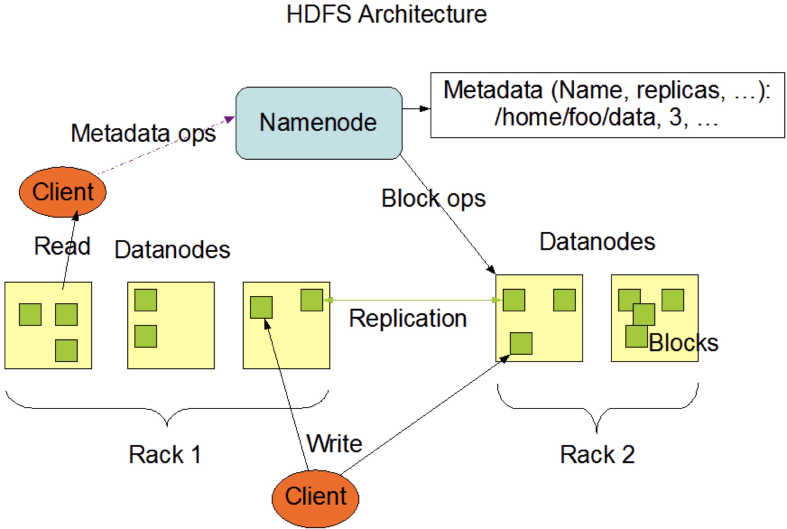
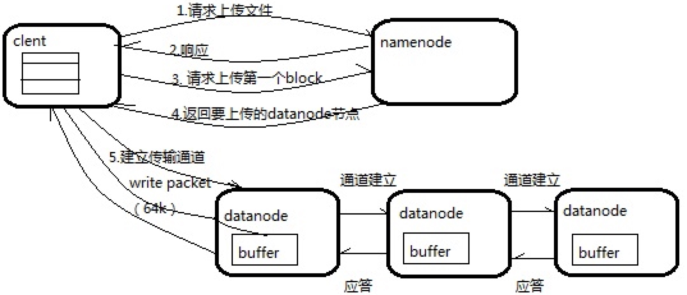
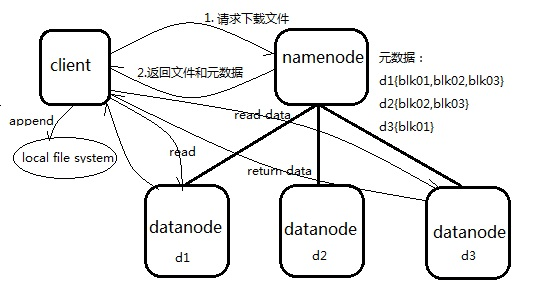

### 1,HDFS产生的背景
HDFS(Hadoop Distribute File System),是一个分布式文件系统。应用场景，适合一次写入，多次读出的场景。
#### 优缺点 
```
优点:
高容错性（一个副本丢失，他可以自动恢复）
可以处理大数据
通过多副本的机制，廉价
缺点：
低延时数据不适合
无法高效的对小文件存储
不支持并发写入，不支持随机修改
```
#### 2,HDFS的组织架构


```
从图中大概可以看出几个重要角色
Namenode：
Namenode是一个master，负责管理HDFS系统的metadata，配置文件的副本，处理客户端请求。
Datanode：
Datanode是一个slave，负责存储实际的数据块，执行数据的读写
client：
客户端，负责和Namenode与DataNode交互
secondary Namenode：
辅助Namenode,简单备份NameNode,比如定期合并Fsimage和Edits，也可以在特定情况下，恢复NameNode
```
#### 3，NameNode的持久化
```
NameNode由两个重要的文件组成，Fsimage和editsLog
HDFS启动时会从Fsimge文件中读取当前metadata，之后对HDFS的操作都会记录在editslog中。
完整的metadata信息就应该由Fsimage和editslog文件组成。Fsimage存储的信息就相当于整个hdfs
在某一个时刻的一个快照。(注意，Fsimage不记录对应的DataNode，因为集群启动后，DataNode信息需要隔断时间上报)
```
如何更新内存中的metadata？
这时候就要用到checkPoint机制，我们来看下面图片：

```
如果HDFS没有做HA的话，checkpoint由SecondaryNameNode进程来进行。
在HA模式下，checkpoint则由StandBy状态的NameNode来进行。
什么时候进行checkpoint由两个参数dfs.namenode.checkpoint.preiod(默认值是3600，即1小时)
和dfs.namenode.checkpoint.txns(默认值是1000000)来决定。
period参数表示，经过1小时就进行一次checkpoint，txns参数表示，hdfs经过100万次操作后就要进行checkpoint了。
这两个参数任意一个得到满足，都会触发checkpoint过程。
进行checkpoint的节点每隔dfs.namenode.checkpoint.check.period(默认值是60）秒就会去统计一次hdfs的操作次数。
看一下默认配置：
[hdfs-default.xml]
<property>
  <name>dfs.namenode.checkpoint.period</name>
  <value>3600</value>
</property>
（2）一分钟检查一次操作次数，3当操作次数达到1百万时，SecondaryNameNode执行一次。
<property>
  <name>dfs.namenode.checkpoint.txns</name>
  <value>1000000</value>
<description>操作动作次数</description>
</property>
<property>
  <name>dfs.namenode.checkpoint.check.period</name>
  <value>60</value>
<description> 1分钟检查一次操作次数</description>
</property >
```
#### 4,HDFS客户端的操作
4.1 对HdfsApi的调用
``` 
详情请参考代码 hdfs-practice
```
4.2 shell语法总结
```
基本语法
bin/hadoop fs 具体命令   OR  bin/hdfs dfs 具体命令
显示目录信息
hadoop fs -ls /
创建目录
hadoop fs -mkdir -p /test
从本地剪切粘贴到HDFS
hadoop fs  -moveFromLocal  ./test.txt  /test
追加一个文件到已经存在的文件末尾
hadoop fs -appendToFile li.txt /test.txt  
删除文件或文件夹
hadoop fs -rm /test.txt
设置HDFS中文件的副本数量（只有机器达到10台副本数量才会生效）
hadoop fs -setrep 10 /san.txt
其他命令：-cp -mv -tail 等等和Linux命令同意
```
#### 5,Hdfs读写文件
##### 我们这里重点看两张图  
###### 写流程

###### 读流程

    挑选一台DataNode（就近原则，然后随机）服务器，请求读取数据。
#### 6,DataNode
##### 6.1 DataNode工作机制  
```
1）一个数据块在DataNode上以文件形式存储在磁盘上，包括两个文件，一个是数据本身，一个是元数据包括数据块的长度，块数据的校验和，以及时间戳。
2）DataNode启动后向NameNode注册，通过后，周期性（1小时）的向NameNode上报所有的块信息。
3）心跳是每3秒一次，心跳返回结果带有NameNode给该DataNode的命令如复制块数据到另一台机器，或删除某个数据块。如果超过10分钟没有收到某个DataNode的心跳，则认为该节点不可用。
4）集群运行中可以安全加入和退出一些机器。
```
##### 6.2 DataNode掉线参数设置
```
需要注意的是hdfs-site.xml 配置文件中的heartbeat.recheck.interval的单位为毫秒，dfs.heartbeat.interval的单位为秒。
计算公式：TimeOut = 2*dfs.namenode.heartbeat.recheck-interval+10*dfs.heartbeat.interval
<property>
    <name>dfs.namenode.heartbeat.recheck-interval</name>
    <value>300000</value>
</property>
<property>
    <name>dfs.heartbeat.interval</name>
    <value>3</value>
</property>
```
##### 6.3 支持新节点DataNode
##### 6.4 设置参数退役就数据节点
```
添加白名单/黑名单
黑名单配置
<property>
<name>dfs.hosts.exclude</name>
      <value>/opt/module/hadoop-2.7.2/etc/hadoop/dfs.hosts.exclude</value>
</property>
白名单配置
<property>
<name>dfs.hosts</name>
<value>/opt/module/hadoop-2.7.2/etc/hadoop/dfs.hosts</value>
</property>
xsync hdfs-site.xml
刷新NameNode
hdfs dfsadmin -refreshNodes
更新ResourceManager节点
yarn rmadmin -refreshNodes
实现集群的数据再平衡
./start-balancer.sh
注意：不允许白名单和黑名单中同时出现同一个主机名称。
```
#### 7,HDFS 2.x新特性
##### 7.1 小文件存档

HDFS存储小文件会耗尽NameNode中的大部分内存。解决方法就是合并成一个。
* 案例实操：
1. 归档文件
bin/hadoop archive -archiveName input.har –p  /user/input   /user/output
2. 解归档文件
hadoop fs -cp har:/// user/output/input.har/*    /user
##### 7.2 回收站
开启回收站功能，可以将删除的文件在不超时的情况下，恢复原数据，起到防止误删除、备份等作用。
* 参数说明
1. 默认值fs.trash.interval=0 ,0表示禁用回收站
2. 默认值fs.trash.checkponit.interval=0，检查回收站的间隔时间。
3. 要求fs.trash.checkponit.interval<=s.trash.interval
* 启用回收站
```
修改core-site.xml
<property>
   <name>fs.trash.interval</name>
<value>1</value>
</property>
```
* 查看回收站
 回收站在集群中的路径：/user/chensude/.Trash/….
* 修改访问垃圾回收站用户名称
```
进入垃圾回收站用户名称，默认是dr.who，修改为chensude用户
[core-site.xml]
<property>
  <name>hadoop.http.staticuser.user</name>
  <value>chensude</value>
</property>
```
* 通过程序删除的文件不会经过回收站，需要调用moveToTrash()才进入回收站
```
Trash trash = New Trash(conf);
trash.moveToTrash(path);
```
* 恢复回收站数据
```
hadoop fs -mv
/user/.Trash/Current/user/chensude/input    /user/chensude/input
```
* 清空回收站
```
hadoop fs -expunge
```
7.3 快照管理
```
1）开启/禁用指定目录的快照功能
hdfs dfsadmin -allowSnapshot /user/input
hdfs dfsadmin -disallowSnapshot /user/input
2）对目录创建快照
hdfs dfs -createSnapshot /user/input
通过web访问hdfs://hadoop102:50070/user/input/.snapshot/s…..// 快照和源文件使用相同数据
hdfs dfs -lsr /user/input/.snapshot/
3）指定名称创建快照
hdfs dfs -createSnapshot /user/input  miao2019
4）重命名快照
hdfs dfs -renameSnapshot /user/input/  miao2019 csd2019
5）列出当前用户所有可快照目录
hdfs lsSnapshottableDir
6）比较两个快照目录的不同之处
hdfs snapshotDiff
 /user/input/  .  .snapshot/csd170508	
7）恢复快照
hdfs dfs -cp
/user/input/.snapshot/s20170708-134303.027 /user
```
#### 8, HDFS HA高可用
HA，即高可用，HDFS的高可用，主要是是NameNode的热备。
有点像mysql的主从，只有active的节点才可以写数据，所有节点都可以读数据。
##### HDFS HA集群配置
8.1 环境准备
* 修改IP
* 修改主机名及主机名和IP地址的映射
* 关闭防火墙
* ssh免密登录
* 安装JDK，配置环境变量等

8.2 规划集群

|centos101|centos102|centos103|
| --- | --- | --- |
|NameNode|NameNode| |
|JournalNode |JournalNode |JournalNode|
|DataNode|DataNode|DataNode|
|ZK|ZK|ZK|
|  |ResourceManager|  |
|NodeManager|NodeManager|NodeManager|

8.3 配置Zookeeper集群
```
1.集群规划
在centos101、centos102和centos103三个节点上部署Zookeeper。
2.安装
1) 解压Zookeeper安装包到/opt/module/目录下
tar -zxvf zookeeper-3.4.10.tar.gz -C /opt/module/
2）在/opt/module/zookeeper-3.4.10/这个目录下创建zkData
mkdir -p zkData
3）重命名/opt/module/zookeeper-3.4.10/conf这个目录下的zoo_sample.cfg为zoo.cfg
3.配置zoo.cfg文件
dataDir=/opt/module/zookeeper-3.4.10/zkData
增加如下配置
#######################cluster##########################
server.2=centos101:2888:3888
server.3=centos102:2888:3888
server.4=centos103:2888:3888
2）配置参数解读
Server.A=B:C:D。
A是一个数字，表示这个是第几号服务器；
B是这个服务器的IP地址；
C是这个服务器与集群中的Leader服务器交换信息的端口；
D是万一集群中的Leader服务器挂了，需要一个端口来重新进行选举，选出一个新的Leader，而这个端口就是用来执行选举时服务器相互通信的端口。
3)在各个机器上/opt/module/zookeeper-3.4.10/zkData目录下创建一个myid的文件
在文件中写入相应的编号，2，3，4
3）分别启动集群
bin/zkServer.sh start
4）查看状态
出现 Foller，leader说明集群搭建成功
```
8.4 配置HDFS-HA集群
```
主要的配置：

配置core-site.xml
<configuration>
<!-- 把两个NameNode）的地址组装成一个集群mycluster -->
    <property>
        <name>fs.defaultFS</name>
        <value>hdfs://mycluster</value>
    </property>
    
    <!-- 指定hadoop运行时产生文件的存储目录 -->
    <property>
        <name>hadoop.tmp.dir</name>
        <value>/opt/ha/hadoop-2.7.2/data/tmp</value>
    </property>
</configuration>

配置hdfs-site.xml
<configuration>
	<!-- 完全分布式集群名称 -->
	<property>
		<name>dfs.nameservices</name>
		<value>mycluster</value>
	</property>

	<!-- 集群中NameNode节点都有哪些 -->
	<property>
		<name>dfs.ha.namenodes.mycluster</name>
		<value>nn1,nn2</value>
	</property>

	<!-- nn1的RPC通信地址 -->
	<property>
		<name>dfs.namenode.rpc-address.mycluster.nn1</name>
		<value>hadoop102:9000</value>
	</property>

	<!-- nn2的RPC通信地址 -->
	<property>
		<name>dfs.namenode.rpc-address.mycluster.nn2</name>
		<value>hadoop103:9000</value>
	</property>

	<!-- nn1的http通信地址 -->
	<property>
		<name>dfs.namenode.http-address.mycluster.nn1</name>
		<value>hadoop102:50070</value>
	</property>

	<!-- nn2的http通信地址 -->
	<property>
		<name>dfs.namenode.http-address.mycluster.nn2</name>
		<value>hadoop103:50070</value>
	</property>

	<!-- 指定NameNode元数据在JournalNode上的存放位置 -->
	<property>
		<name>dfs.namenode.shared.edits.dir</name>
	<value>qjournal://hadoop102:8485;hadoop103:8485;hadoop104:8485/mycluster</value>
	</property>

	<!-- 配置隔离机制，即同一时刻只能有一台服务器对外响应 -->
	<property>
		<name>dfs.ha.fencing.methods</name>
		<value>sshfence</value>
	</property>

	<!-- 使用隔离机制时需要ssh无秘钥登录-->
	<property>
		<name>dfs.ha.fencing.ssh.private-key-files</name>
		<value>/home/.ssh/id_rsa</value>
	</property>

	<!-- 声明journalnode服务器存储目录-->
	<property>
		<name>dfs.journalnode.edits.dir</name>
		<value>/opt/ha/hadoop-2.7.2/data/jn</value>
	</property>

	<!-- 关闭权限检查-->
	<property>
		<name>dfs.permissions.enable</name>
		<value>false</value>
	</property>

	<!-- 访问代理类：client，mycluster，active配置失败自动切换实现方式-->
	<property>
  		<name>dfs.client.failover.proxy.provider.mycluster</name>
	<value>org.apache.hadoop.hdfs.server.namenode.ha.ConfiguredFailoverProxyProvider</value>
	</property>
</configuration>
拷贝配置好的hadoop环境到其他节点
```
8.4.2 启动HDFS-HA集群
```
1.在各个JournalNode节点上，输入以下命令启动journalnode服务
sbin/hadoop-daemon.sh start journalnode
2.在[nn1]上，对其进行格式化，并启动
bin/hdfs namenode -format
sbin/hadoop-daemon.sh start namenode
3.在[nn2]上，同步nn1的元数据信息
bin/hdfs namenode -bootstrapStandby
4.启动[nn2]
sbin/hadoop-daemon.sh start namenode
5.查看web页面显示
6.在[nn1]上，启动所有datanode
sbin/hadoop-daemons.sh start datanode
7.将[nn1]切换为Active
bin/hdfs haadmin -transitionToActive nn1
7.查看是否Active
bin/hdfs haadmin -getServiceState nn1
```
8.4.3 配置HDFS-HA自动故障转移
```
1.具体配置
1）在hdfs-site.xml中增加
<property>
	<name>dfs.ha.automatic-failover.enabled</name>
	<value>true</value>
</property>
2）在core-site.xml文件中增加
<property>
	<name>ha.zookeeper.quorum</name>
	<value>hadoop102:2181,hadoop103:2181,hadoop104:2181</value>
</property>
2.启动
1）关闭所有HDFS服务：
sbin/stop-dfs.sh
2）启动Zookeeper集群：
bin/zkServer.sh start
3）初始化HA在Zookeeper中状态：
bin/hdfs zkfc -formatZK
4）启动HDFS服务：
sbin/start-dfs.sh
5）在各个NameNode节点上启动DFSZK Failover Controller，先在哪台机器启动，哪个机器的NameNode就是Active NameNode
sbin/hadoop-daemin.sh start zkfc
3.验证
1）将Active NameNode进程kill
kill -9 namenode的进程id
2）将Active NameNode机器断开网络
service network stop
```
8.4.4 YARN-HA配置
```
1）yarn-site.xml
<configuration>
    <property>
        <name>yarn.nodemanager.aux-services</name>
        <value>mapreduce_shuffle</value>
    </property>

    <!--启用resourcemanager ha-->
    <property>
        <name>yarn.resourcemanager.ha.enabled</name>
        <value>true</value>
    </property>
 
    <!--声明两台resourcemanager的地址-->
    <property>
        <name>yarn.resourcemanager.cluster-id</name>
        <value>cluster-yarn1</value>
    </property>

    <property>
        <name>yarn.resourcemanager.ha.rm-ids</name>
        <value>rm1,rm2</value>
    </property>

    <property>
        <name>yarn.resourcemanager.hostname.rm1</name>
        <value>hadoop102</value>
    </property>

    <property>
        <name>yarn.resourcemanager.hostname.rm2</name>
        <value>hadoop103</value>
    </property>
 
    <!--指定zookeeper集群的地址--> 
    <property>
        <name>yarn.resourcemanager.zk-address</name>
        <value>hadoop102:2181,hadoop103:2181,hadoop104:2181</value>
    </property>

    <!--启用自动恢复--> 
    <property>
        <name>yarn.resourcemanager.recovery.enabled</name>
        <value>true</value>
    </property>
 
    <!--指定resourcemanager的状态信息存储在zookeeper集群--> 
    <property>
        <name>yarn.resourcemanager.store.class</name>     <value>org.apache.hadoop.yarn.server.resourcemanager.recovery.ZKRMStateStore</value>
</property>
</configuration>
2）同步更新其他节点的配置信息
4.启动hdfs 
1）在各个JournalNode节点上，输入以下命令启动journalnode服务：
sbin/hadoop-daemon.sh start journalnode
2）在[nn1]上，对其进行格式化，并启动：
bin/hdfs namenode -format
sbin/hadoop-daemon.sh start namenode
3）在[nn2]上，同步nn1的元数据信息：
bin/hdfs namenode -bootstrapStandby
4）启动[nn2]：
sbin/hadoop-daemon.sh start namenode
5）启动所有DataNode
sbin/hadoop-daemons.sh start datanode
6）将[nn1]切换为Active
bin/hdfs haadmin -transitionToActive nn1
5.启动YARN 
1）在hadoop102中执行：
sbin/start-yarn.sh
2）在hadoop103中执行：
sbin/yarn-daemon.sh start resourcemanager
3）查看服务状态，如图3-24所示
bin/yarn rmadmin -getServiceState rm1
```