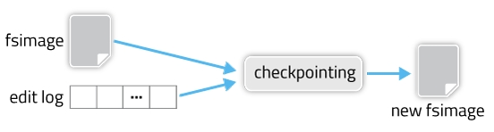

### 1,HDFS产生的背景
HDFS(Hadoop Distribute File System),是一个分布式文件系统。应用场景，适合一次写入，多次读出的场景。
#### 优缺点 
```
优点:
高容错性（一个副本丢失，他可以自动恢复）
可以处理大数据
通过多副本的机制，廉价
缺点：
低延时数据不适合
无法高效的对小文件存储
不支持并发写入，不支持随机修改
```
#### 2,HDFS的组织架构


```
从图中大概可以看出几个重要角色
Namenode：
Namenode是一个master，负责管理HDFS系统的metadata，配置文件的副本，处理客户端请求。
Datanode：
Datanode是一个slave，负责存储实际的数据块，执行数据的读写
client：
客户端，负责和Namenode与DataNode交互
secondary Namenode：
辅助Namenode,简单备份NameNode,比如定期合并Fsimage和Edits，也可以在特定情况下，恢复NameNode
```
#### 3，NameNode的持久化
```
NameNode由两个重要的文件组成，Fsimage和editsLog
HDFS启动时会从Fsimge文件中读取当前metadata，之后对HDFS的操作都会记录在editslog中。
完整的metadata信息就应该由Fsimage和editslog文件组成。Fsimage存储的信息就相当于整个hdfs
在某一个时刻的一个快照。(注意，Fsimage不记录对应的DataNode，因为集群启动后，DataNode信息需要隔断时间上报)
```
如何更新内存中的metadata？
这时候就要用到checkPoint机制，我们来看下面图片：

```
如果HDFS没有做HA的话，checkpoint由SecondaryNameNode进程来进行。
在HA模式下，checkpoint则由StandBy状态的NameNode来进行。
什么时候进行checkpoint由两个参数dfs.namenode.checkpoint.preiod(默认值是3600，即1小时)
和dfs.namenode.checkpoint.txns(默认值是1000000)来决定。
period参数表示，经过1小时就进行一次checkpoint，txns参数表示，hdfs经过100万次操作后就要进行checkpoint了。
这两个参数任意一个得到满足，都会触发checkpoint过程。
进行checkpoint的节点每隔dfs.namenode.checkpoint.check.period(默认值是60）秒就会去统计一次hdfs的操作次数。
看一下默认配置：
[hdfs-default.xml]
<property>
  <name>dfs.namenode.checkpoint.period</name>
  <value>3600</value>
</property>
（2）一分钟检查一次操作次数，3当操作次数达到1百万时，SecondaryNameNode执行一次。
<property>
  <name>dfs.namenode.checkpoint.txns</name>
  <value>1000000</value>
<description>操作动作次数</description>
</property>
<property>
  <name>dfs.namenode.checkpoint.check.period</name>
  <value>60</value>
<description> 1分钟检查一次操作次数</description>
</property >
```
#### 4,HDFS客户端的操作

