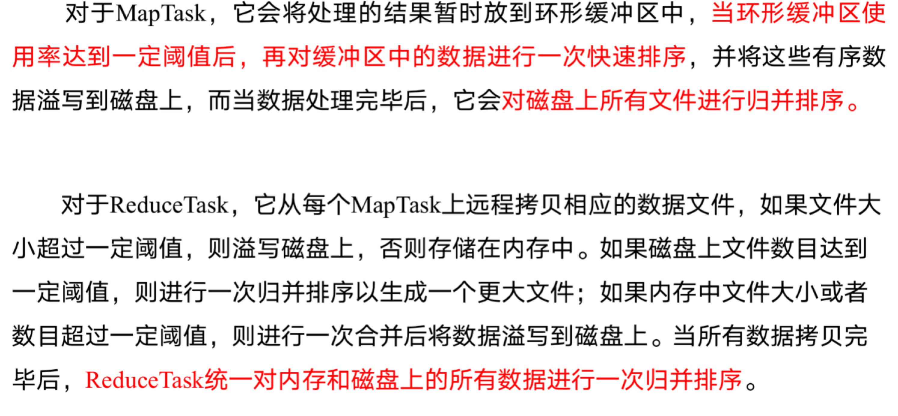

### MapReduce 概述
#### 1,定义
##### 1.1 mapreduce是一个分布式程序的编程框架。主要是一个计算框架。
```
优点：
1,易于编程
2,良好的扩展性
3,高容错性
4,适合PB级别以上海量数据的离线处理
缺点：
1,不擅长实时计算
2,不擅长流式计算
3,不擅长DAG(有向图）计算
```
##### 1.2 MapReduce阶段
```
1) MrAppMaster: 负责整个程序的过程调度及状态协调
2）MapTask: 负责Map阶段的整个数据处理流程
3）ReduceTask: 负责Reduce阶段的整个数据处理流程
```
##### 1.3 常用序列化类型对比
| java类型 |Hadoop Writable  |
| --- | --- |
| boolean|BooleanWritable|
| byte |ByteWritable|
| int |IntWritable|
| float |FloatWritable|
| long |LongWritable|
| double|DoubleWritable|
| String|Text|
| map |MapWritable|
| array |ArrayWritable|

#### 2,MapReduce框架原理

数据切片：数据切片只是在逻辑上对输入进行分片，并不会在磁盘上将其切分成片进行存储。
```
1)一个job的Map阶段并行度由客户端在提交job的切片数决定的
2)每个split切片分配一个maptask并行实例处理
3）默认情况下，切片大小=BlockSize
4）切片不考虑整体，而是单独对一个文件进行
```
##### 2.1,job提交源码分析
```
waitForCompletion()

submit();

// 1建立连接
connect();	
// 1）创建提交Job的代理
new Cluster(getConfiguration());
// （1）判断是本地yarn还是远程
initialize(jobTrackAddr, conf); 

// 2 提交job
submitter.submitJobInternal(Job.this, cluster)
// 1）创建给集群提交数据的Stag路径
Path jobStagingArea = JobSubmissionFiles.getStagingDir(cluster, conf);

// 2）获取jobid ，并创建Job路径
JobID jobId = submitClient.getNewJobID();

// 3）拷贝jar包到集群
copyAndConfigureFiles(job, submitJobDir);	
rUploader.uploadFiles(job, jobSubmitDir);

// 4）计算切片，生成切片规划文件
writeSplits(job, submitJobDir);
maps = writeNewSplits(job, jobSubmitDir);
input.getSplits(job);

// 5）向Stag路径写XML配置文件
writeConf(conf, submitJobFile);
conf.writeXml(out);

// 6）提交Job,返回提交状态
status = submitClient.submitJob(jobId, submitJobDir.toString(), job.getCredentials());

```
下面结合图来看大概流程

这里我们可以深入了解一下生产切片规划（FileInPutFormat)，我们来进入代码看一下发生了什么(我截取了核心)？
```
//protected long getFormatMinSplitSize() {
//   return 1;
//  }
//public static long getMinSplitSize(JobContext job) {
//    return job.getConfiguration().getLong(SPLIT_MINSIZE, 1L);
//}
// public static final String SPLIT_MINSIZE = 
//    "mapreduce.input.fileinputformat.split.minsize"
//上面注释可以看出来，如果不配置minsize参数，默认为1
long minSize = Math.max(getFormatMinSplitSize(), getMinSplitSize(job));


// public static long getMaxSplitSize(JobContext context) {
//    return context.getConfiguration().getLong(SPLIT_MAXSIZE, 
//                                              Long.MAX_VALUE);
// }
//上面注释可以看出来，如果不配置，默认为Long.Max_VALUE
long maxSize = getMaxSplitSize(job);

for (FileStatus file: files) {
  Path path = file.getPath();
  long length = file.getLen();
  if (length != 0) {
    if (isSplitable(job, path)) {
      long blockSize = file.getBlockSize();
      long splitSize = computeSplitSize(blockSize, minSize, maxSize);

      long bytesRemaining = length;
      //SPLIT_SLOP=1.1
      while (((double) bytesRemaining)/splitSize > SPLIT_SLOP) {
        int blkIndex = getBlockIndex(blkLocations, length-bytesRemaining);
        splits.add(makeSplit(path, length-bytesRemaining, splitSize,
                    blkLocations[blkIndex].getHosts(),
                    blkLocations[blkIndex].getCachedHosts()));
        bytesRemaining -= splitSize;
      }

      if (bytesRemaining != 0) {
        int blkIndex = getBlockIndex(blkLocations, length-bytesRemaining);
        splits.add(makeSplit(path, length-bytesRemaining, bytesRemaining,
                   blkLocations[blkIndex].getHosts(),
                   blkLocations[blkIndex].getCachedHosts()));
      }
    } else { // not splitable
      splits.add(makeSplit(path, 0, length, blkLocations[0].getHosts(),
                  blkLocations[0].getCachedHosts()));
    }
  }
}

补充一下computeSplitSize的代码
Math.max(minSize, Math.min(maxSize, blockSize));
```
总结以上代码：
* 程序先找到你数据存储的目录
* 开始遍历目录下的每一个文件
* 遍历第一个文件ss.txt
* 计算切片的大小，公式：Math.max(minSize, Math.min(maxSize, blockSize));默认等于blockSize
* 开始切，形成第一个切片：ss.txt-0:128M第二个切片128M:256M,第三个切片256M:300M
（每次切片时，都要判断切完剩下的部分是否大于1.1倍，不大于1.1倍就划分为最后一块切片）
* 将切片写入一个切片规划文件中
* InputSplit只记录了切片的元数据信息，比如原始位置，长度已经所在列表等。
* 提交整个规划文件到YARN上,YARN上MrAPPMaster可以根据切片规划文件计算开启MapTask的个数<br/>

##### 2.2,补充CombineTextInputFormat切片类
CombineTextInputFormat:用于小文件过多的场景,可以从逻辑上规划多个小文件到一个文件中。<br/>
1，虚拟存储切片最大值设置
CombineTextInputFormat.setMaxInputSplitSize(job, 4194304);// 4m
注意：虚拟存储切片最大值设置最好根据实际的小文件大小情况来设置具体的值。<br/>
首先用图片看一下整体过程：

（1）虚拟存储过程：
将输入目录下所有文件大小，依次和设置的setMaxInputSplitSize值比较，如果不大于设置的最大值，逻辑上划分一个块。如果输入文件大于设置的最大值且大于两倍，那么以最大值切割一块；当剩余数据大小超过设置的最大值且不大于最大值2倍，此时将文件均分成2个虚拟存储块（防止出现太小切片）。
（2）切片过程：
（a）判断虚拟存储的文件大小是否大于setMaxInputSplitSize值，大于等于则单独形成一个切片。
（b）如果不大于则跟下一个虚拟存储文件进行合并，共同形成一个切片。
```
例如setMaxInputSplitSize值为4M，输入文件大小为8.02M，则先逻辑上分成一个4M。剩余的大小为4.02M，如果按照4M逻辑划分，就会出现0.02M的小的虚拟存储文件，所以将剩余的4.02M文件切分成（2.01M和2.01M）两个文件。
增加如下代码
// 如果不设置InputFormat，它默认用的是TextInputFormat.class
job.setInputFormatClass(CombineTextInputFormat.class);

//虚拟存储切片最大值设置20m
CombineTextInputFormat.setMaxInputSplitSize(job, 20971520);
运行如果为1个切片。
```
##### 2.3,FileInputFormat实现类
2.3.1 FileInputFormat<br/>
默认实现类是TextInputFormat。按行读取，建是存储该行在整个文件中
的起始偏移量，longWritable类型。值是这行的内容（不包括换行符和回车符）,Text类型。<br/>
2.3.2 KeyValueTextInputFormat<br/>
每一行均为一条记录,被分隔符分割为key，value。可以通过在驱动类中设置
conf.set(KeyValueLineRecordReader.Key_Value_Seperator,"\t")来设定分隔符。默认分隔符是tab("\t")<br/>
2.3.3 NlineInputFormat<bnr/>
如果使用NlineInputFormat，代表分片按照指定的N来划分。即输入文件的总行数/N=切片数。
这里的key和value和TextInputFormat一样。
##### 2.4,MapReduce工作流程
2.4.1 mr的工作流程图


```
1.流程详解
上面的流程是整个MapReduce最全工作流程，但是Shuffle过程只是从第7步开始到第16步结束，具体Shuffle过程详解，如下：
1）MapTask收集我们的map()方法输出的kv对，放到内存缓冲区中
2）从内存缓冲区不断溢出本地磁盘文件，可能会溢出多个文件
3）多个溢出文件会被合并成大的溢出文件
4）在溢出过程及合并的过程中，都要调用Partitioner进行分区和针对key进行排序
5）ReduceTask根据自己的分区号，去各个MapTask机器上取相应的结果分区数据
6）ReduceTask会取到同一个分区的来自不同MapTask的结果文件，ReduceTask会将这些文件再进行合并（归并排序）
7）合并成大文件后，Shuffle的过程也就结束了，后面进入ReduceTask的逻辑运算过程（从文件中取出一个一个的键值对Group，调用用户自定义的reduce()方法）
2．注意
Shuffle中的缓冲区大小会影响到MapReduce程序的执行效率，原则上说，缓冲区越大，磁盘io的次数越少，执行速度就越快。
缓冲区的大小可以通过参数调整，参数：io.sort.mb默认100M。
```
2.4.2 mr的shuffle机制

2.4.3 mr的patition分区
按照条件输出不同文件中（分区），分区这个概念影响着输出文件的个数，默认分区为HashPatitioner,用户没法控制分到哪个区
```
 /** Use {@link Object#hashCode()} to partition. */
  public int getPartition(K2 key, V2 value,
                          int numReduceTasks) {
    return (key.hashCode() & Integer.MAX_VALUE) % numReduceTasks;
  }
```
需要自定义分区
```
1)extends Partitioner,重写getPartition()方法
2）设置自定义partitioner
  job.setPartitionerClass(CustomPartition.class);
3）设置自定义partitioner的相应的reduceTask
 job.setNumReduceTasks(4);
分区总结：
（1)如果ReduceTask的数量>getPartition的结果数，则会多产生几个空的输出文件part-r-000xx;
 (2)如果1<ReduceTask的数量<getPartition的结果数，则有一部分分区数据无处安放，会exception
（3)如果ReduceTask的数量=1，则不管MapTask输出多少分区文件，最终结果都交给一个ReduceTask，最终也只会有一个输出文件part-r-000xx;
（4)分区号必须从零开始，逐一累加。
```
2.4.4 排序<br/>
排序是MapReduce框架中最重要的操作之一
mapReduce和ReduceTask均会对数据按照key进行排序。属于Hadoop默认行为。默认排序是字典顺序排序，且实现该排序的方法是快速排序。

自定义排序需要实现WritableComparable，实现接口compareTo方法。
```
@Override
public int compareTo(FlowBean o) {
	int result;	
	// 按照总流量大小，倒序排列
	if (conditon) {
		result = -1;
	}else if (condition) {
		result = 1;
	}else {
		result = 0;
	}
	return result;
}
```
2.4.5 分组<br/>
对Reduce阶段的数据根据某一个或几个字段进行分组。
```
分组排序步骤：
1）自定义类继承WritableComparator
2）重写compare()方法
@Override
public int compare(WritableComparable a, WritableComparable b) {
    // 比较的业务逻辑
    return result;
}
3）创建一个构造将比较对象的类传给父类
protected OrderGroupingComparator() {
		super(OrderBean.class, true);
}
```
#### 2.5,MapTask工作机制
2.5.1 MapTask工作机制

```
（1）Read阶段：MapTask通过用户编写的RecordReader，从输入InputSplit中解析出一个个key/value。
（2）Map阶段：该节点主要是将解析出的key/value交给用户编写map()函数处理，并产生一系列新的key/value。
（3）Collect收集阶段：在用户编写map()函数中，当数据处理完成后，一般会调用OutputCollector.collect()输出结果。在该函数内部，它会将生成的key/value分区（调用Partitioner），并写入一个环形内存缓冲区中。
（4）Spill阶段：即“溢写”，当环形缓冲区满后，MapReduce会将数据写到本地磁盘上，生成一个临时文件。需要注意的是，将数据写入本地磁盘之前，先要对数据进行一次本地排序，并在必要时对数据进行合并、压缩等操作。
```
2.5.2 ReduceTask工作机制

```
（1）Copy阶段：ReduceTask从各个MapTask上远程拷贝一片数据，并针对某一片数据，如果其大小超过一定阈值，则写到磁盘上，否则直接放到内存中。
（2）Merge阶段：在远程拷贝数据的同时，ReduceTask启动了两个后台线程对内存和磁盘上的文件进行合并，以防止内存使用过多或磁盘上文件过多。
（3）Sort阶段：按照MapReduce语义，用户编写reduce()函数输入数据是按key进行聚集的一组数据。为了将key相同的数据聚在一起，Hadoop采用了基于排序的策略。由于各个MapTask已经实现对自己的处理结果进行了局部排序，因此，ReduceTask只需对所有数据进行一次归并排序即可。
（4）Reduce阶段：reduce()函数将计算结果写到HDFS上
```
#### 3,Hadoop数据压缩
压缩技术能够有效减少底层存储系统读写字节数。<br/>
MR支持的压缩编码

压缩方式对比：
```
1,GZIP
Hadoop自身支持,但是不支持split，应用场景：当每个文件压缩之后在130M（1个块大小内），都可以考虑Gzip压缩格式。
2,Bzip2
优点：支持split；具有很高的压缩率，比Gzip压缩率都高；Hadoop本身自带，使用方便。
缺点：压缩/解压速度慢。
3，Lzo压缩
优点：压缩/解压速度比较快，合理的压缩率。支持split，是Hadoop最流行的压缩格式。
缺点：压缩率比Gzip要低一些；Hadoop本身不支持。需要安装；使用中需要进行特殊处理(为了支持split需要建索引，还需要指定InputFormat为Lzo格式）。
4,snappy压缩
优点：高速压缩速度和合理的压缩率。
缺点：不支持split，压缩率比Gzip要低；Hadoop本身不支持，需要安装。
```
压缩参数

| 参数 |默认值  |阶段  |建议  |
| --- | --- | --- | --- |
| io.compression.codecs   
  （在core-site.xml中配置） |org.apache.hadoop.io.compress.DefaultCodec, org.apache.hadoop.io.compress.GzipCodec, org.apache.hadoop.io.compress.BZip2Codec  | 输入压缩 | Hadoop使用文件扩展名判断是否支持某种编解码器 |
|mapreduce.map.output.compress（在mapred-site.xml中配置）  | false | mapper输出 | 这个参数设为true启用压缩 |
|mapreduce.map.output.compress.codec（在mapred-site.xml中配置）  | org.apache.hadoop.io.compress.DefaultCodec |mapper输出  |企业多使用LZO或Snappy编解码器在此阶段压缩数据  |
|mapreduce.output.fileoutputformat.compress（在mapred-site.xml中配置）  | false | reducer输出 | 这个参数设为true启用压缩 |
|mapreduce.output.fileoutputformat.compress.codec（在mapred-site.xml中配置）  |org.apache.hadoop.io.compress. DefaultCodec  |reducer输出  | 使用标准工具或者编解码器，如gzip和bzip2 |
|mapreduce.output.fileoutputformat.compress.type（在mapred-site.xml中配置）  | RECORD |reducer输出  |SequenceFile输出使用的压缩类型：NONE和BLOCK  |
数据流的压缩和解压缩
CompressionCodec有两个方法可以用于轻松地压缩或解压缩数据
```
对正在被写入一个输出流的数据进行压缩，我们可以使用createOutputStream(OutPutStreamout)方法创建一个CompressionOutputStream，将其以压缩格式写入底层的流。
相反，对从输入流读取而来的数据进行解压缩，则调用createInputStream(InputStream)函数，从而获取一个CompressionInputStream，从而从底层的流读取未压缩的数据。
DEFLATE	org.apache.hadoop.io.compress.DefaultCodec
gzip	org.apache.hadoop.io.compress.GzipCodec
bzip2	org.apache.hadoop.io.compress.BZip2Codec

public class TestCompress {

public static void main(String[] args) throws Exception {
    compress("e:/hello.txt","org.apache.hadoop.io.compress.BZip2Codec");
//		decompress("e:/hello.txt.bz2");
}

// 1、压缩
private static void compress(String filename, String method) throws Exception {
    
    // （1）获取输入流
    FileInputStream fis = new FileInputStream(new File(filename));
    
    Class codecClass = Class.forName(method);
    
    CompressionCodec codec = (CompressionCodec) ReflectionUtils.newInstance(codecClass, new Configuration());
    
    // （2）获取输出流
    FileOutputStream fos = new FileOutputStream(new File(filename + codec.getDefaultExtension()));
    CompressionOutputStream cos = codec.createOutputStream(fos);
    
    // （3）流的对拷
    IOUtils.copyBytes(fis, cos, 1024*1024*5, false);
    
    // （4）关闭资源
    cos.close();
    fos.close();
fis.close();
}

// 2、解压缩
private static void decompress(String filename) throws FileNotFoundException, IOException {
    
    // （0）校验是否能解压缩
    CompressionCodecFactory factory = new CompressionCodecFactory(new Configuration());

    CompressionCodec codec = factory.getCodec(new Path(filename));
    
    if (codec == null) {
        System.out.println("cannot find codec for file " + filename);
        return;
    }
    
    // （1）获取输入流
    CompressionInputStream cis = codec.createInputStream(new FileInputStream(new File(filename)));
    
    // （2）获取输出流
    FileOutputStream fos = new FileOutputStream(new File(filename + ".decoded"));
    
    // （3）流的对拷
    IOUtils.copyBytes(cis, fos, 1024*1024*5, false);
    
    // （4）关闭资源
    cis.close();
    fos.close();
}
}
```
map端压缩
```
给大家提供的Hadoop源码支持的压缩格式有：BZip2Codec 、DefaultCodec
// 开启map端输出压缩
configuration.setBoolean("mapreduce.map.output.compress", true);
    // 设置map端输出压缩方式
configuration.setClass("mapreduce.map.output.compress.codec", BZip2Codec.class, CompressionCodec.class);
```
Reduce端压缩
```
给大家提供的Hadoop源码支持的压缩格式有：BZip2Codec 、DefaultCodec
// 设置reduce端输出压缩开启
FileOutputFormat.setCompressOutput(job, true);

// 设置压缩的方式
FileOutputFormat.setOutputCompressorClass(job, BZip2Codec.class); 
```
#### 4,Yarn资源调度器
yarn是一个资源调度平台，负责运算程序提供服务器运算资源，想当一个分布式操作系统平台。<br/>
4.1,Yarn基本架构
Yarn主要有ResourceManager，NodeManager，ApplicationMaster和Continaer等组件构成。

4,2 Yarn工作机制

```
2．工作机制详解
（1）MR程序提交到客户端所在的节点。
（2）YarnRunner向ResourceManager申请一个Application。
（3）RM将该应用程序的资源路径返回给YarnRunner。
（4）该程序将运行所需资源提交到HDFS上。
（5）程序资源提交完毕后，申请运行mrAppMaster。
（6）RM将用户的请求初始化成一个Task。
（7）其中一个NodeManager领取到Task任务。
（8）该NodeManager创建容器Container，并产生MRAppmaster。
（9）Container从HDFS上拷贝资源到本地。
（10）MRAppmaster向RM 申请运行MapTask资源。
（11）RM将运行MapTask任务分配给另外两个NodeManager，另两个NodeManager分别领取任务并创建容器。
（12）MR向两个接收到任务的NodeManager发送程序启动脚本，这两个NodeManager分别启动MapTask，MapTask对数据分区排序。
（13）MrAppMaster等待所有MapTask运行完毕后，向RM申请容器，运行ReduceTask。
（14）ReduceTask向MapTask获取相应分区的数据。
（15）程序运行完毕后，MR会向RM申请注销自己。
```
4.3 Yarn作业提交

```
作业提交全过程详解
1）作业提交
第1步：Client调用job.waitForCompletion方法，向整个集群提交MapReduce作业。
第2步：Client向RM申请一个作业id。
第3步：RM给Client返回该job资源的提交路径和作业id。
第4步：Client提交jar包、切片信息和配置文件到指定的资源提交路径。
第5步：Client提交完资源后，向RM申请运行MrAppMaster。
2）作业初始化
第6步：当RM收到Client的请求后，将该job添加到容量调度器中。
第7步：某一个空闲的NM领取到该Job。
第8步：该NM创建Container，并产生MRAppmaster。
第9步：下载Client提交的资源到本地。
3）任务分配
第10步：MrAppMaster向RM申请运行多个MapTask任务资源。
第11步：RM将运行MapTask任务分配给另外两个NodeManager，另两个NodeManager分别领取任务并创建容器。
4）任务运行
第12步：MR向两个接收到任务的NodeManager发送程序启动脚本，这两个NodeManager分别启动MapTask，MapTask对数据分区排序。
第13步：MrAppMaster等待所有MapTask运行完毕后，向RM申请容器，运行ReduceTask。
第14步：ReduceTask向MapTask获取相应分区的数据。
第15步：程序运行完毕后，MR会向RM申请注销自己。
5）进度和状态更新
YARN中的任务将其进度和状态(包括counter)返回给应用管理器, 客户端每秒(通过mapreduce.client.progressmonitor.pollinterval设置)向应用管理器请求进度更新, 展示给用户。
6）作业完成
除了向应用管理器请求作业进度外, 客户端每5秒都会通过调用waitForCompletion()来检查作业是否完成。时间间隔可以通过mapreduce.client.completion.pollinterval来设置。作业完成之后, 应用管理器和Container会清理工作状态。作业的信息会被作业历史服务器存储以备之后用户核查。
```
4.4 资源调度器<br/>
Hadoop作业调度器主要有三种：FIFO、Capacity Scheduler和Fair Scheduler。Hadoop2.7.2默认的资源调度器是Capacity Scheduler。
```
具体设置详见：yarn-default.xml文件
<property>
    <description>The class to use as the resource scheduler.</description>
    <name>yarn.resourcemanager.scheduler.class</name>
<value>org.apache.hadoop.yarn.server.resourcemanager.scheduler.capacity.CapacityScheduler</value>
</property>
```
4.4.1 FIFO=job加入队列<br/>
4.4.2 容量调度器

4.4.3 公平调度器

#### 5,Hadoop企业的优化
5.1 数据输入
```
1)合并小文件：在执行MR任务前将小文件进行合并，大量的小文件会产生大量的Map任务，增大Map任务装载次数，而任务装载比较耗时。
2）采用CombineTextInputFormat来作为输入，解决输入端大量小文件场景。
```
5.2 Map阶段
```
1)减少溢写（spill)次数：通过调整io.sort.mb及sort.spill.percent参数值，增大触发spill的内存上限，减少spill，从而减少IO
2）减少合并次数：通过调整io.sort.factor参数，增大merge的文件数目，减少merge的次数。
3）在Map之后，不影响业务逻辑前提下，先进行Combine处理，减少IO。
```
5.3 Reduce阶段
```
1)合理设置Map和Reduce数
2）设置Map，REduce共存
3）规避使用Reduce：因为Reduce在用于链接数据的时候将会产生大量的网络消耗
4）合理设置Reduce端的Buffer
```
5.4 I/O传输
```
1)采用数据压缩的方式
2）使用SequenFile二进制文件
```
5.5 调优参数
```
1．资源相关参数
（1）以下参数是在用户自己的MR应用程序中配置就可以生效（mapred-default.xml）
表4-12
配置参数	参数说明
mapreduce.map.memory.mb	一个MapTask可使用的资源上限（单位:MB），默认为1024。如果MapTask实际使用的资源量超过该值，则会被强制杀死。
mapreduce.reduce.memory.mb	一个ReduceTask可使用的资源上限（单位:MB），默认为1024。如果ReduceTask实际使用的资源量超过该值，则会被强制杀死。
mapreduce.map.cpu.vcores	每个MapTask可使用的最多cpu core数目，默认值: 1
mapreduce.reduce.cpu.vcores	每个ReduceTask可使用的最多cpu core数目，默认值: 1
mapreduce.reduce.shuffle.parallelcopies	每个Reduce去Map中取数据的并行数。默认值是5
mapreduce.reduce.shuffle.merge.percent	Buffer中的数据达到多少比例开始写入磁盘。默认值0.66
mapreduce.reduce.shuffle.input.buffer.percent	Buffer大小占Reduce可用内存的比例。默认值0.7
mapreduce.reduce.input.buffer.percent	指定多少比例的内存用来存放Buffer中的数据，默认值是0.0
（2）应该在YARN启动之前就配置在服务器的配置文件中才能生效（yarn-default.xml）
表4-13
配置参数	参数说明
yarn.scheduler.minimum-allocation-mb	  	给应用程序Container分配的最小内存，默认值：1024
yarn.scheduler.maximum-allocation-mb	  	给应用程序Container分配的最大内存，默认值：8192
yarn.scheduler.minimum-allocation-vcores		每个Container申请的最小CPU核数，默认值：1
yarn.scheduler.maximum-allocation-vcores		每个Container申请的最大CPU核数，默认值：32
yarn.nodemanager.resource.memory-mb   	给Containers分配的最大物理内存，默认值：8192
（3）Shuffle性能优化的关键参数，应在YARN启动之前就配置好（mapred-default.xml）
表4-14
配置参数	参数说明
mapreduce.task.io.sort.mb   	Shuffle的环形缓冲区大小，默认100m
mapreduce.map.sort.spill.percent   	环形缓冲区溢出的阈值，默认80%
2．容错相关参数(MapReduce性能优化)
表4-15
配置参数	参数说明
mapreduce.map.maxattempts	每个Map Task最大重试次数，一旦重试参数超过该值，则认为Map Task运行失败，默认值：4。
mapreduce.reduce.maxattempts	每个Reduce Task最大重试次数，一旦重试参数超过该值，则认为Map Task运行失败，默认值：4。
mapreduce.task.timeout	Task超时时间，经常需要设置的一个参数，该参数表达的意思为：如果一个Task在一定时间内没有任何进入，
即不会读取新的数据，也没有输出数据，则认为该Task处于Block状态，可能是卡住了，也许永远会卡住，为了防止因为用户程序永远Block住不退出，
则强制设置了一个该超时时间（单位毫秒），默认是600000。如果你的程序对每条输入数据的处理时间过长（比如会访问数据库，通过网络拉取数据等），
建议将该参数调大，该参数过小常出现的错误提示是“AttemptID:attempt_14267829456721_123456_m_000224_0 Timed out after 300 secsContainer killed by the ApplicationMaster.”。
```