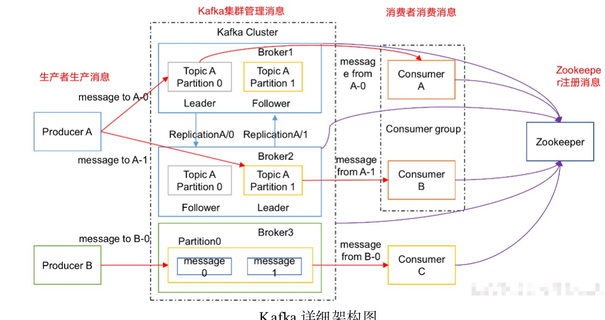
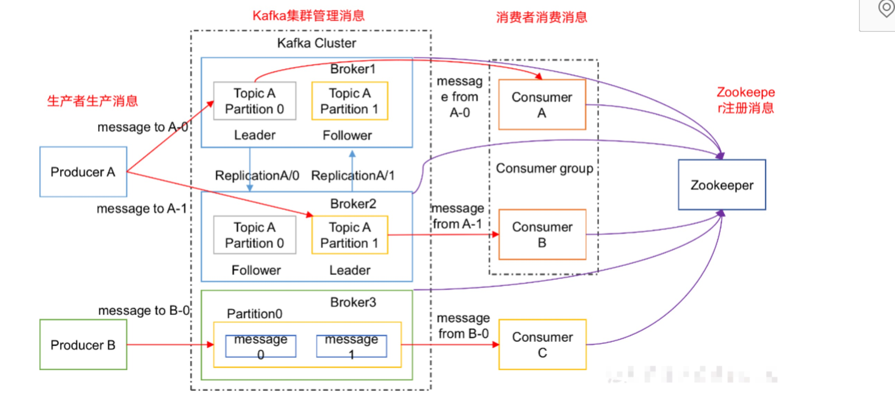
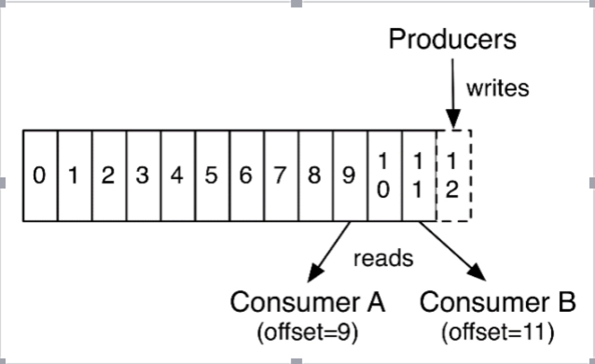
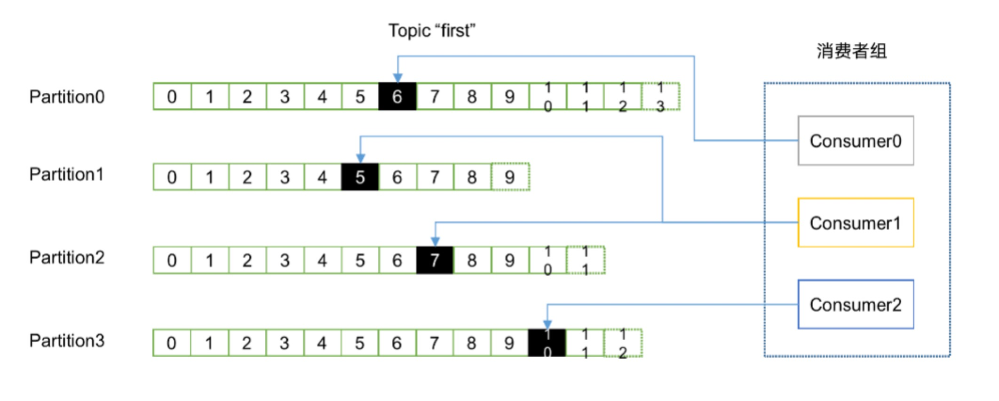

#### kafka
##### 1,kafka架构

```
1）Producer ：消息生产者，就是向kafka broker发消息的客户端；
2）Consumer ：消息消费者，向kafka broker取消息的客户端；
3）Topic ：可以理解为一个队列；
4）Consumer Group （CG）：这是kafka用来实现一个topic消息的广播（发给所有的consumer）和单播（发给任意一个consumer）的手段。一个topic可以有多个CG。topic的消息会复制（不是真的复制，是概念上的）到所有的CG，但每个partion只会把消息发给该CG中的一个consumer。如果需要实现广播，只要每个consumer有一个独立的CG就可以了。要实现单播只要所有的consumer在同一个CG。用CG还可以将consumer进行自由的分组而不需要多次发送消息到不同的topic；
5）Broker ：一台kafka服务器就是一个broker。一个集群由多个broker组成。一个broker可以容纳多个topic；
6）Partition：为了实现扩展性，一个非常大的topic可以分布到多个broker（即服务器）上，一个topic可以分为多个partition，每个partition是一个有序的队列。partition中的每条消息都会被分配一个有序的id（offset）。kafka只保证按一个partition中的顺序将消息发给consumer，不保证一个topic的整体（多个partition间）的顺序；
7）Offset：kafka的存储文件都是按照offset.kafka来命名，用offset做名字的好处是方便查找。例如你想找位于2049的位置，只要找到2048.kafka的文件即可。当然the first offset就是00000000000.kafka。
```
##### 2,Kafka集群部署
```
1）解压安装包
tar -zxvf kafka_2.11-0.11.0.0.tgz -C /opt/module/
2）修改解压后的文件名称
mv kafka_2.11-0.11.0.0/ kafka
3）在/opt/module/kafka目录下创建logs文件夹
mkdir logs
4）修改配置文件
cd config/
vi server.properties
输入以下内容：
#broker的全局唯一编号，不能重复
broker.id=0
#删除topic功能使能
delete.topic.enable=true
#处理网络请求的线程数量
num.network.threads=3
#用来处理磁盘IO的现成数量
num.io.threads=8
#发送套接字的缓冲区大小
socket.send.buffer.bytes=102400
#接收套接字的缓冲区大小
socket.receive.buffer.bytes=102400
#请求套接字的缓冲区大小
socket.request.max.bytes=104857600
#kafka运行日志存放的路径	
log.dirs=/opt/module/kafka/logs
#topic在当前broker上的分区个数
num.partitions=1
#用来恢复和清理data下数据的线程数量
num.recovery.threads.per.data.dir=1
#segment文件保留的最长时间，超时将被删除
log.retention.hours=168
#配置连接Zookeeper集群地址
zookeeper.connect=hadoop102:2181,hadoop103:2181,hadoop104:2181
5）配置环境变量
sudo vi /etc/profile

#KAFKA_HOME
export KAFKA_HOME=/opt/module/kafka
export PATH=$PATH:$KAFKA_HOME/bin
source /etc/profile
6）分发安装包
xsync kafka/
注意：分发之后记得配置其他机器的环境变量
7）分别在hadoop103和hadoop104上修改配置文件/opt/module/kafka/config/server.properties中的broker.id=1、broker.id=2
注：broker.id不得重复
8）启动集群
依次在hadoop102、hadoop103、hadoop104节点上启动kafka
bin/kafka-server-start.sh config/server.properties &
bin/kafka-server-start.sh config/server.properties &
bin/kafka-server-start.sh config/server.properties &
9）关闭集群
bin/kafka-server-stop.sh stop
bin/kafka-server-stop.sh stop
bin/kafka-server-stop.sh stop
```
kafka命令行操作
```
1）查看当前服务器中的所有topic
bin/kafka-topics.sh --zookeeper hadoop102:2181 --list
2）创建topic
bin/kafka-topics.sh --zookeeper hadoop102:2181 \
--create --replication-factor 3 --partitions 1 --topic first
选项说明：
--topic 定义topic名
--replication-factor  定义副本数
--partitions  定义分区数
3）删除topic
bin/kafka-topics.sh --zookeeper hadoop102:2181 \
--delete --topic first
需要server.properties中设置delete.topic.enable=true否则只是标记删除或者直接重启。
4）发送消息
bin/kafka-console-producer.sh \
--broker-list hadoop102:9092 --topic first
>hello world
>heihei
5）消费消息
bin/kafka-console-consumer.sh \
--zookeeper hadoop102:2181 --from-beginning --topic first
--from-beginning：会把first主题中以往所有的数据都读取出来。根据业务场景选择是否增加该配置。
6）查看某个Topic的详情
bin/kafka-topics.sh --zookeeper hadoop102:2181 \
--describe --topic first
```
#### 3,kafka工作流程分析

3.1 kafka生产过程分析

```
3.1.1 写入方式
producer采用推（push）模式将消息发布到broker，每条消息都被追加（append）到分区（patition）中，属于顺序写磁盘（顺序写磁盘效率比随机写内存要高，保障kafka吞吐率）。
3.1.2 分区（Partition）
消息发送时都被发送到一个topic，其本质就是一个目录，而topic是由一些Partition Logs(分区日志)组成，其组织结构如上图所示：
2）分区的原则
（1）指定了patition，则直接使用；
（2）未指定patition但指定key，通过对key的value进行hash出一个patition；
（3）patition和key都未指定，使用轮询选出一个patition。
DefaultPartitioner类
public int partition(String topic, Object key, byte[] keyBytes, Object value, byte[] valueBytes, Cluster cluster) {
    List<PartitionInfo> partitions = cluster.partitionsForTopic(topic);
    int numPartitions = partitions.size();
    if (keyBytes == null) {
        int nextValue = nextValue(topic);
        List<PartitionInfo> availablePartitions = cluster.availablePartitionsForTopic(topic);
        if (availablePartitions.size() > 0) {
            int part = Utils.toPositive(nextValue) % availablePartitions.size();
            return availablePartitions.get(part).partition();
        } else {
            // no partitions are available, give a non-available partition
            return Utils.toPositive(nextValue) % numPartitions;
        }
    } else {
        // hash the keyBytes to choose a partition
        return Utils.toPositive(Utils.murmur2(keyBytes)) % numPartitions;
    }
}
3.1.3 副本（Replication）
同一个partition可能会有多个replication（对应 server.properties 配置中的 default.replication.factor=N）。没有replication的情况下，一旦broker 宕机，其上所有 patition 的数据都不可被消费，同时producer也不能再将数据存于其上的patition。引入replication之后，同一个partition可能会有多个replication，而这时需要在这些replication之间选出一个leader，producer和consumer只与这个leader交互，其它replication作为follower从leader 中复制数据。
```
3.2 Broker保存消息
```
物理上把topic分成一个或多个patition（对应 server.properties 中的num.partitions=3配置），每个patition物理上对应一个文件夹（该文件夹存储该patition的所有消息和索引文件）
3.2.2 存储策略
无论消息是否被消费，kafka都会保留所有消息。有两种策略可以删除旧数据：
1）基于时间：log.retention.hours=168
2）基于大小：log.retention.bytes=1073741824
需要注意的是，因为Kafka读取特定消息的时间复杂度为O(1)，即与文件大小无关，所以这里删除过期文件与提高 Kafka 性能无关。
注意：producer不在zk中注册，消费者在zk中注册。
3.3 Kafka消费过程分析
kafka提供了两套consumer API：高级Consumer API和低级Consumer API。
3.3.1 高级API
1）高级API优点
不需要自行去管理offset，系统通过zookeeper自行管理。
不需要管理分区，副本等情况，.系统自动管理。
2）高级API缺点
不能自行控制offset（对于某些特殊需求来说）
3.3.2 低级API
1）低级 API 优点
能够让开发者自己控制offset，想从哪里读取就从哪里读取
2）低级API缺点
太过复杂，需要自行控制offset，连接哪个分区，找到分区leader 等。
```
3.3 消费者组

```
消费者是以consumer group消费者组的方式工作，由一个或者多个消费者组成一个组，共同消费一个topic。每个分区在同一时间只能由group中的一个消费者读取，但是多个group可以同时消费这个partition。在图中，有一个由三个消费者组成的group，有一个消费者读取主题中的两个分区，另外两个分别读取一个分区。某个消费者读取某个分区，也可以叫做某个消费者是某个分区的拥有者。
在这种情况下，消费者可以通过水平扩展的方式同时读取大量的消息。另外，如果一个消费者失败了，那么其他的group成员会自动负载均衡读取之前失败的消费者读取的分区。
```
#### 4,Kafka API实战
参考项目代码 kafka-practice
#### 5,Kafka 扩展
```
5.1 Kafka Streams 
Kafka Streams。Apache Kafka开源项目的一个组成部分。是一个功能强大，易于使用的库。用于在Kafka上构建高可分布式、拓展性，容错的应用程序。
第一，Spark和Storm都是流式处理框架，而Kafka Stream提供的是一个基于Kafka的流式处理类库
第二，虽然Cloudera与Hortonworks方便了Storm和Spark的部署，但是这些框架的部署仍然相对复杂。而Kafka Stream作为类库，可以非常方便的嵌入应用程序中，它对应用的打包和部署基本没有任何要求。
第三，大部分流式系统中都已部署了Kafka，此时使用Kafka Stream的成本非常低。
```
5.2 案例实操
```
public class Application {

	public static void main(String[] args) {

		// 定义输入的topic
        String from = "first";
        // 定义输出的topic
        String to = "second";

        // 设置参数
        Properties settings = new Properties();
        settings.put(StreamsConfig.APPLICATION_ID_CONFIG, "logFilter");
        settings.put(StreamsConfig.BOOTSTRAP_SERVERS_CONFIG, "hadoop102:9092");

        StreamsConfig config = new StreamsConfig(settings);

        // 构建拓扑
        TopologyBuilder builder = new TopologyBuilder();

        builder.addSource("SOURCE", from)
               .addProcessor("PROCESS", new ProcessorSupplier<byte[], byte[]>() {

					@Override
					public Processor<byte[], byte[]> get() {
						// 具体分析处理
						return new LogProcessor();
					}
				}, "SOURCE")
                .addSink("SINK", to, "PROCESS");

        // 创建kafka stream
        KafkaStreams streams = new KafkaStreams(builder, config);
        streams.start();
	}
}

//具体业务处理
public class LogProcessor implements Processor<byte[], byte[]> {
	
	private ProcessorContext context;
	
	@Override
	public void init(ProcessorContext context) {
		this.context = context;
	}

	@Override
	public void process(byte[] key, byte[] value) {
		String input = new String(value);
		
		// 如果包含“>>>”则只保留该标记后面的内容
		if (input.contains(">>>")) {
			input = input.split(">>>")[1].trim();
			// 输出到下一个topic
			context.forward("logProcessor".getBytes(), input.getBytes());
		}else{
			context.forward("logProcessor".getBytes(), input.getBytes());
		}
	}

	@Override
	public void punctuate(long timestamp) {
		
	}

	@Override
	public void close() {
		
	}
}
```
5.3 kafka和flume比较
```
flume：cloudera公司研发:
适合多个生产者；
适合下游数据消费者不多的情况；
适合数据安全性要求不高的操作；
适合与Hadoop生态圈对接的操作。
kafka：linkedin公司研发:
适合数据下游消费众多的情况；
适合数据安全性要求较高的操作，支持replication。
因此我们常用的一种模型是：
线上数据 --> flume --> kafka --> flume(根据情景增删该流程) --> HDFS
```
5.4 kafka配置信息
```
7.3.1 Broker配置信息
属性	默认值	描述
broker.id		必填参数，broker的唯一标识
log.dirs	/tmp/kafka-logs	Kafka数据存放的目录。可以指定多个目录，中间用逗号分隔，当新partition被创建的时会被存放到当前存放partition最少的目录。
port	9092	BrokerServer接受客户端连接的端口号
zookeeper.connect	null	Zookeeper的连接串，格式为：hostname1:port1,hostname2:port2,hostname3:port3。可以填一个或多个，为了提高可靠性，建议都填上。注意，此配置允许我们指定一个zookeeper路径来存放此kafka集群的所有数据，为了与其他应用集群区分开，建议在此配置中指定本集群存放目录，格式为：hostname1:port1,hostname2:port2,hostname3:port3/chroot/path 。需要注意的是，消费者的参数要和此参数一致。
message.max.bytes	1000000	服务器可以接收到的最大的消息大小。注意此参数要和consumer的maximum.message.size大小一致，否则会因为生产者生产的消息太大导致消费者无法消费。
num.io.threads	8	服务器用来执行读写请求的IO线程数，此参数的数量至少要等于服务器上磁盘的数量。
queued.max.requests	500	I/O线程可以处理请求的队列大小，若实际请求数超过此大小，网络线程将停止接收新的请求。
socket.send.buffer.bytes	100 * 1024	The SO_SNDBUFF buffer the server prefers for socket connections.
socket.receive.buffer.bytes	100 * 1024	The SO_RCVBUFF buffer the server prefers for socket connections.
socket.request.max.bytes	100 * 1024 * 1024	服务器允许请求的最大值， 用来防止内存溢出，其值应该小于 Java heap size.
num.partitions	1	默认partition数量，如果topic在创建时没有指定partition数量，默认使用此值，建议改为5
log.segment.bytes	1024 * 1024 * 1024	Segment文件的大小，超过此值将会自动新建一个segment，此值可以被topic级别的参数覆盖。
log.roll.{ms,hours}	24 * 7 hours	新建segment文件的时间，此值可以被topic级别的参数覆盖。
log.retention.{ms,minutes,hours}	7 days	Kafka segment log的保存周期，保存周期超过此时间日志就会被删除。此参数可以被topic级别参数覆盖。数据量大时，建议减小此值。
log.retention.bytes	-1	每个partition的最大容量，若数据量超过此值，partition数据将会被删除。注意这个参数控制的是每个partition而不是topic。此参数可以被log级别参数覆盖。
log.retention.check.interval.ms	5 minutes	删除策略的检查周期
auto.create.topics.enable	true	自动创建topic参数，建议此值设置为false，严格控制topic管理，防止生产者错写topic。
default.replication.factor	1	默认副本数量，建议改为2。
replica.lag.time.max.ms	10000	在此窗口时间内没有收到follower的fetch请求，leader会将其从ISR(in-sync replicas)中移除。
replica.lag.max.messages	4000	如果replica节点落后leader节点此值大小的消息数量，leader节点就会将其从ISR中移除。
replica.socket.timeout.ms	30 * 1000	replica向leader发送请求的超时时间。
replica.socket.receive.buffer.bytes	64 * 1024	The socket receive buffer for network requests to the leader for replicating data.
replica.fetch.max.bytes	1024 * 1024	The number of byes of messages to attempt to fetch for each partition in the fetch requests the replicas send to the leader.
replica.fetch.wait.max.ms	500	The maximum amount of time to wait time for data to arrive on the leader in the fetch requests sent by the replicas to the leader.
num.replica.fetchers	1	Number of threads used to replicate messages from leaders. Increasing this value can increase the degree of I/O parallelism in the follower broker.
fetch.purgatory.purge.interval.requests	1000	The purge interval (in number of requests) of the fetch request purgatory.
zookeeper.session.timeout.ms	6000	ZooKeeper session 超时时间。如果在此时间内server没有向zookeeper发送心跳，zookeeper就会认为此节点已挂掉。 此值太低导致节点容易被标记死亡；若太高，.会导致太迟发现节点死亡。
zookeeper.connection.timeout.ms	6000	客户端连接zookeeper的超时时间。
zookeeper.sync.time.ms	2000	H ZK follower落后 ZK leader的时间。
controlled.shutdown.enable	true	允许broker shutdown。如果启用，broker在关闭自己之前会把它上面的所有leaders转移到其它brokers上，建议启用，增加集群稳定性。
auto.leader.rebalance.enable	true	If this is enabled the controller will automatically try to balance leadership for partitions among the brokers by periodically returning leadership to the “preferred” replica for each partition if it is available.
leader.imbalance.per.broker.percentage	10	The percentage of leader imbalance allowed per broker. The controller will rebalance leadership if this ratio goes above the configured value per broker.
leader.imbalance.check.interval.seconds	300	The frequency with which to check for leader imbalance.
offset.metadata.max.bytes	4096	The maximum amount of metadata to allow clients to save with their offsets.
connections.max.idle.ms	600000	Idle connections timeout: the server socket processor threads close the connections that idle more than this.
num.recovery.threads.per.data.dir	1	The number of threads per data directory to be used for log recovery at startup and flushing at shutdown.
unclean.leader.election.enable	true	Indicates whether to enable replicas not in the ISR set to be elected as leader as a last resort, even though doing so may result in data loss.
delete.topic.enable	false	启用deletetopic参数，建议设置为true。
offsets.topic.num.partitions	50	The number of partitions for the offset commit topic. Since changing this after deployment is currently unsupported, we recommend using a higher setting for production (e.g., 100-200).
offsets.topic.retention.minutes	1440	Offsets that are older than this age will be marked for deletion. The actual purge will occur when the log cleaner compacts the offsets topic.
offsets.retention.check.interval.ms	600000	The frequency at which the offset manager checks for stale offsets.
offsets.topic.replication.factor	3	The replication factor for the offset commit topic. A higher setting (e.g., three or four) is recommended in order to ensure higher availability. If the offsets topic is created when fewer brokers than the replication factor then the offsets topic will be created with fewer replicas.
offsets.topic.segment.bytes	104857600	Segment size for the offsets topic. Since it uses a compacted topic, this should be kept relatively low in order to facilitate faster log compaction and loads.
offsets.load.buffer.size	5242880	An offset load occurs when a broker becomes the offset manager for a set of consumer groups (i.e., when it becomes a leader for an offsets topic partition). This setting corresponds to the batch size (in bytes) to use when reading from the offsets segments when loading offsets into the offset manager’s cache.
offsets.commit.required.acks	-1	The number of acknowledgements that are required before the offset commit can be accepted. This is similar to the producer’s acknowledgement setting. In general, the default should not be overridden.
offsets.commit.timeout.ms	5000	The offset commit will be delayed until this timeout or the required number of replicas have received the offset commit. This is similar to the producer request timeout.
7.3.2 Producer配置信息
属性	默认值	描述
metadata.broker.list		启动时producer查询brokers的列表，可以是集群中所有brokers的一个子集。注意，这个参数只是用来获取topic的元信息用，producer会从元信息中挑选合适的broker并与之建立socket连接。格式是：host1:port1,host2:port2。
request.required.acks	0	参见3.2节介绍
request.timeout.ms	10000	Broker等待ack的超时时间，若等待时间超过此值，会返回客户端错误信息。
producer.type	sync	同步异步模式。async表示异步，sync表示同步。如果设置成异步模式，可以允许生产者以batch的形式push数据，这样会极大的提高broker性能，推荐设置为异步。
serializer.class	kafka.serializer.DefaultEncoder	序列号类，.默认序列化成 byte[] 。
key.serializer.class		Key的序列化类，默认同上。
partitioner.class	kafka.producer.DefaultPartitioner	Partition类，默认对key进行hash。
compression.codec	none	指定producer消息的压缩格式，可选参数为： “none”, “gzip” and “snappy”。关于压缩参见4.1节
compressed.topics	null	启用压缩的topic名称。若上面参数选择了一个压缩格式，那么压缩仅对本参数指定的topic有效，若本参数为空，则对所有topic有效。
message.send.max.retries	3	Producer发送失败时重试次数。若网络出现问题，可能会导致不断重试。
retry.backoff.ms	100	Before each retry, the producer refreshes the metadata of relevant topics to see if a new leader has been elected. Since leader election takes a bit of time, this property specifies the amount of time that the producer waits before refreshing the metadata.
topic.metadata.refresh.interval.ms	600 * 1000	The producer generally refreshes the topic metadata from brokers when there is a failure (partition missing, leader not available…). It will also poll regularly (default: every 10min so 600000ms). If you set this to a negative value, metadata will only get refreshed on failure. If you set this to zero, the metadata will get refreshed after each message sent (not recommended). Important note: the refresh happen only AFTER the message is sent, so if the producer never sends a message the metadata is never refreshed
queue.buffering.max.ms	5000	启用异步模式时，producer缓存消息的时间。比如我们设置成1000时，它会缓存1秒的数据再一次发送出去，这样可以极大的增加broker吞吐量，但也会造成时效性的降低。
queue.buffering.max.messages	10000	采用异步模式时producer buffer 队列里最大缓存的消息数量，如果超过这个数值，producer就会阻塞或者丢掉消息。
queue.enqueue.timeout.ms	-1	当达到上面参数值时producer阻塞等待的时间。如果值设置为0，buffer队列满时producer不会阻塞，消息直接被丢掉。若值设置为-1，producer会被阻塞，不会丢消息。
batch.num.messages	200	采用异步模式时，一个batch缓存的消息数量。达到这个数量值时producer才会发送消息。
send.buffer.bytes	100 * 1024	Socket write buffer size
client.id	“”	The client id is a user-specified string sent in each request to help trace calls. It should logically identify the application making the request.
7.3.3 Consumer配置信息
属性	默认值	描述
group.id		Consumer的组ID，相同goup.id的consumer属于同一个组。
zookeeper.connect		Consumer的zookeeper连接串，要和broker的配置一致。
consumer.id	null	如果不设置会自动生成。
socket.timeout.ms	30 * 1000	网络请求的socket超时时间。实际超时时间由max.fetch.wait + socket.timeout.ms 确定。
socket.receive.buffer.bytes	64 * 1024	The socket receive buffer for network requests.
fetch.message.max.bytes	1024 * 1024	查询topic-partition时允许的最大消息大小。consumer会为每个partition缓存此大小的消息到内存，因此，这个参数可以控制consumer的内存使用量。这个值应该至少比server允许的最大消息大小大，以免producer发送的消息大于consumer允许的消息。
num.consumer.fetchers	1	The number fetcher threads used to fetch data.
auto.commit.enable	true	如果此值设置为true，consumer会周期性的把当前消费的offset值保存到zookeeper。当consumer失败重启之后将会使用此值作为新开始消费的值。
auto.commit.interval.ms	60 * 1000	Consumer提交offset值到zookeeper的周期。
queued.max.message.chunks	2	用来被consumer消费的message chunks 数量， 每个chunk可以缓存fetch.message.max.bytes大小的数据量。
auto.commit.interval.ms	60 * 1000	Consumer提交offset值到zookeeper的周期。
queued.max.message.chunks	2	用来被consumer消费的message chunks 数量， 每个chunk可以缓存fetch.message.max.bytes大小的数据量。
fetch.min.bytes	1	The minimum amount of data the server should return for a fetch request. If insufficient data is available the request will wait for that much data to accumulate before answering the request.
fetch.wait.max.ms	100	The maximum amount of time the server will block before answering the fetch request if there isn’t sufficient data to immediately satisfy fetch.min.bytes.
rebalance.backoff.ms	2000	Backoff time between retries during rebalance.
refresh.leader.backoff.ms	200	Backoff time to wait before trying to determine the leader of a partition that has just lost its leader.
auto.offset.reset	largest	What to do when there is no initial offset in ZooKeeper or if an offset is out of range ;smallest : automatically reset the offset to the smallest offset; largest : automatically reset the offset to the largest offset;anything else: throw exception to the consumer
consumer.timeout.ms	-1	若在指定时间内没有消息消费，consumer将会抛出异常。
exclude.internal.topics	true	Whether messages from internal topics (such as offsets) should be exposed to the consumer.
zookeeper.session.timeout.ms	6000	ZooKeeper session timeout. If the consumer fails to heartbeat to ZooKeeper for this period of time it is considered dead and a rebalance will occur.
zookeeper.connection.timeout.ms	6000	The max time that the client waits while establishing a connection to zookeeper.
zookeeper.sync.time.ms	2000	How far a ZK follower can be behind a ZK leader
```