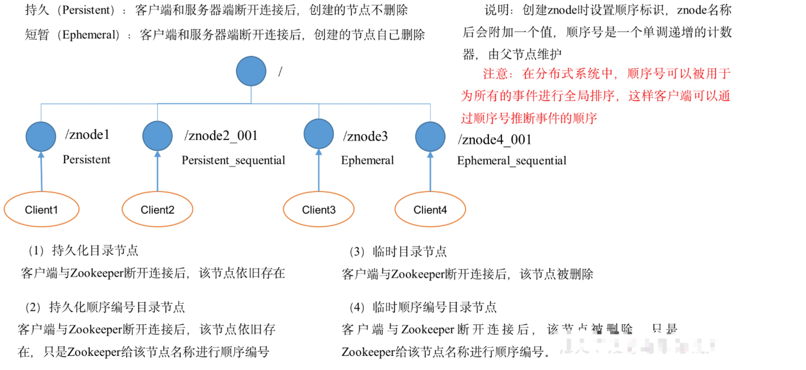
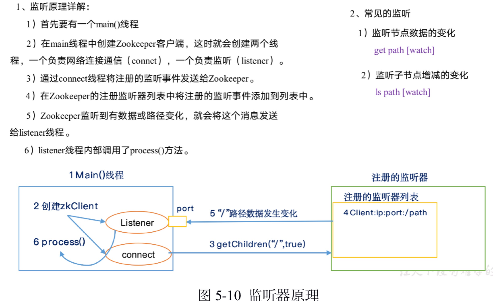
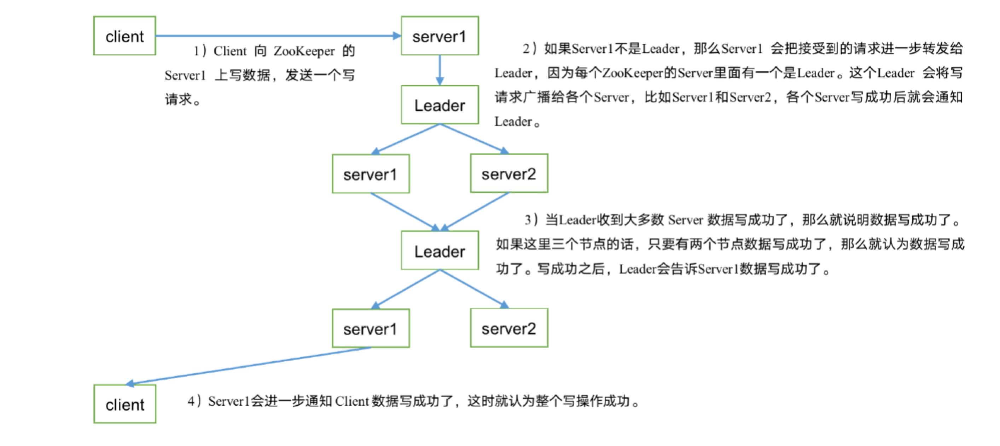

#### Zookeeper
##### 1,概述
```
Zookeeper是一个开源的分布式应用提供协调服务的Apache项目
应用场景：提供的服务包括：统一命名服务，统一配置管理，统一集群管理，服务器节点动态上线，软负载均衡等。
```

##### 2,Zookeeper安装
```
1．安装前准备
1）安装Jdk
2）拷贝Zookeeper安装包到Linux系统下
3）解压到指定目录
tar -zxvf zookeeper-3.4.10.tar.gz -C /opt/module/
2．配置修改
1）将/opt/module/zookeeper-3.4.10/conf这个路径下的zoo_sample.cfg修改为zoo.cfg；
mv zoo_sample.cfg zoo.cfg
2）打开zoo.cfg文件，修改dataDir路径：
vim zoo.cfg
修改如下内容：
dataDir=/opt/module/zookeeper-3.4.10/zkData
3）在/opt/module/zookeeper-3.4.10/这个目录上创建zkData文件夹
 mkdir zkData
3．操作Zookeeper
（1）启动Zookeeper
bin/zkServer.sh start
（2）查看进程是否启动
jps
4020 Jps
4001 QuorumPeerMain
（3）查看状态：
bin/zkServer.sh status
ZooKeeper JMX enabled by default
Using config: /opt/module/zookeeper-3.4.10/bin/../conf/zoo.cfg
Mode: standalone
（4）启动客户端：
bin/zkCli.sh
（5）退出客户端：
[zk: localhost:2181(CONNECTED) 0] quit
（6）停止Zookeeper
bin/zkServer.sh stop
2.2 配置参数解读
Zookeeper中的配置文件zoo.cfg中参数含义解读如下：
1．tickTime =2000：通信心跳数，Zookeeper服务器与客户端心跳时间，单位毫秒
Zookeeper使用的基本时间，服务器之间或客户端与服务器之间维持心跳的时间间隔，也就是每个tickTime时间就会发送一个心跳，时间单位为毫秒。
它用于心跳机制，并且设置最小的session超时时间为两倍心跳时间。(session的最小超时时间是2*tickTime)
2．initLimit =10：LF初始通信时限
集群中的Follower跟随者服务器与Leader领导者服务器之间初始连接时能容忍的最多心跳数（tickTime的数量），用它来限定集群中的Zookeeper服务器连接到Leader的时限。
3．syncLimit =5：LF同步通信时限
集群中Leader与Follower之间的最大响应时间单位，假如响应超过syncLimit * tickTime，Leader认为Follwer死掉，从服务器列表中删除Follwer。
4．dataDir：数据文件目录+数据持久化路径
主要用于保存Zookeeper中的数据。
5．clientPort =2181：客户端连接端口
监听客户端连接的端口。
```
##### 3,Zookeeper内部原理
```
1）半数机制：集群中半数以上机器存活，集群可用。所以Zookeeper适合安装奇数台服务器。
2）Zookeeper虽然在配置文件中并没有指定Master和Slave。但是，Zookeeper工作时，是有一个节点为Leader，其他则为Follower，Leader是通过内部的选举机制临时产生的。
1,2,3,4,5 台服务器启动，1，启动，looking,2启动，胜出（少于半数以上），looking，3启动胜出，成为leader，4，5自然成为小弟followerr
```
3.2 节点类型

3.3 Stat结构体
```
1）czxid-创建节点的事务zxid
每次修改ZooKeeper状态都会收到一个zxid形式的时间戳，也就是ZooKeeper事务ID。
事务ID是ZooKeeper中所有修改总的次序。每个修改都有唯一的zxid，如果zxid1小于zxid2，那么zxid1在zxid2之前发生。
2）ctime - znode被创建的毫秒数(从1970年开始)
3）mzxid - znode最后更新的事务zxid
4）mtime - znode最后修改的毫秒数(从1970年开始)
5）pZxid-znode最后更新的子节点zxid
6）cversion - znode子节点变化号，znode子节点修改次数
7）dataversion - znode数据变化号
8）aclVersion - znode访问控制列表的变化号
9）ephemeralOwner- 如果是临时节点，这个是znode拥有者的session id。如果不是临时节点则是0。
10）dataLength- znode的数据长度
11）numChildren - znode子节点数量
```
3.4 监听原理

3.5 写数据流程

#### 4,zookeeper实战
4.1 分布式部署
```
4.1 分布式安装部署
1．集群规划
在hadoop102、hadoop103和hadoop104三个节点上部署Zookeeper。
2．解压安装
（1）解压Zookeeper安装包到/opt/module/目录下
tar -zxvf zookeeper-3.4.10.tar.gz -C /opt/module/
（2）同步/opt/module/zookeeper-3.4.10目录内容到hadoop103、hadoop104
xsync zookeeper-3.4.10/
3．配置服务器编号
1）在/opt/module/zookeeper-3.4.10/这个目录下创建zkData
mkdir -p zkData
2）在/opt/module/zookeeper-3.4.10/zkData目录下创建一个myid的文件
touch myid
添加myid文件，注意一定要在linux里面创建，在notepad++里面很可能乱码
3）编辑myid文件
vi myid
在文件中添加与server对应的编号：
2
4）拷贝配置好的zookeeper到其他机器上
xsync myid
并分别在hadoop102、hadoop103上修改myid文件中内容为3、4
4．配置zoo.cfg文件
1）重命名/opt/module/zookeeper-3.4.10/conf这个目录下的zoo_sample.cfg为zoo.cfg
mv zoo_sample.cfg zoo.cfg
2）打开zoo.cfg文件
vim zoo.cfg
修改数据存储路径配置
dataDir=/opt/module/zookeeper-3.4.10/zkData
增加如下配置
#######################cluster##########################
server.2=hadoop102:2888:3888
server.3=hadoop103:2888:3888
server.4=hadoop104:2888:3888
（3）同步zoo.cfg配置文件
xsync zoo.cfg
（4）配置参数解读
server.A=B:C:D。
A是一个数字，表示这个是第几号服务器；
集群模式下配置一个文件myid，这个文件在dataDir目录下，这个文件里面有一个数据就是A的值，Zookeeper启动时读取此文件，拿到里面的数据与zoo.cfg里面的配置信息比较从而判断到底是哪个server。
B是这个服务器的ip地址；
C是这个服务器与集群中的Leader服务器交换信息的端口；
D是万一集群中的Leader服务器挂了，需要一个端口来重新进行选举，选出一个新的Leader，而这个端口就是用来执行选举时服务器相互通信的端口。
4．集群操作
1）分别启动Zookeeper
bin/zkServer.sh start
bin/zkServer.sh start
bin/zkServer.sh start
2）查看状态
bin/zkServer.sh status
JMX enabled by default
Using config: /opt/module/zookeeper-3.4.10/bin/../conf/zoo.cfg
Mode: follower
bin/zkServer.sh status
JMX enabled by default
Using config: /opt/module/zookeeper-3.4.10/bin/../conf/zoo.cfg
Mode: leader
bin/zkServer.sh status
JMX enabled by default
Using config: /opt/module/zookeeper-3.4.10/bin/../conf/zoo.cfg
Mode: follower
```
4.2 客户端命令
```
1．启动客户端
bin/zkCli.sh
2．显示所有操作命令
[zk: localhost:2181(CONNECTED) 1] help
3．查看当前znode中所包含的内容
[zk: localhost:2181(CONNECTED) 0] ls /
[zookeeper]
4．查看当前节点详细数据
[zk: localhost:2181(CONNECTED) 1] ls2 /
[zookeeper]
cZxid = 0x0
ctime = Thu Jan 01 08:00:00 CST 1970
mZxid = 0x0
mtime = Thu Jan 01 08:00:00 CST 1970
pZxid = 0x0
cversion = -1
dataVersion = 0
aclVersion = 0
ephemeralOwner = 0x0
dataLength = 0
numChildren = 1
5．分别创建2个普通节点
[zk: localhost:2181(CONNECTED) 3] create /sanguo "jinlian"
Created /sanguo
[zk: localhost:2181(CONNECTED) 4] create /sanguo/shuguo "liubei"
Created /sanguo/shuguo
6．获得节点的值
[zk: localhost:2181(CONNECTED) 5] get /sanguo
jinlian
cZxid = 0x100000003
ctime = Wed Aug 29 00:03:23 CST 2018
mZxid = 0x100000003
mtime = Wed Aug 29 00:03:23 CST 2018
pZxid = 0x100000004
cversion = 1
dataVersion = 0
aclVersion = 0
ephemeralOwner = 0x0
dataLength = 7
numChildren = 1
[zk: localhost:2181(CONNECTED) 6]
[zk: localhost:2181(CONNECTED) 6] get /sanguo/shuguo
liubei
cZxid = 0x100000004
ctime = Wed Aug 29 00:04:35 CST 2018
mZxid = 0x100000004
mtime = Wed Aug 29 00:04:35 CST 2018
pZxid = 0x100000004
cversion = 0
dataVersion = 0
aclVersion = 0
ephemeralOwner = 0x0
dataLength = 6
numChildren = 0
7．创建短暂节点
[zk: localhost:2181(CONNECTED) 7] create -e /sanguo/wuguo "zhouyu"
Created /sanguo/wuguo
（1）在当前客户端是能查看到的
[zk: localhost:2181(CONNECTED) 3] ls /sanguo 
[wuguo, shuguo]
（2）退出当前客户端然后再重启客户端
[zk: localhost:2181(CONNECTED) 12] quit
bin/zkCli.sh
（3）再次查看根目录下短暂节点已经删除
[zk: localhost:2181(CONNECTED) 0] ls /sanguo
[shuguo]
8．创建带序号的节点
1）先创建一个普通的根节点/sanguo/weiguo
[zk: localhost:2181(CONNECTED) 1] create /sanguo/weiguo "caocao"
Created /sanguo/weiguo
2）创建带序号的节点
[zk: localhost:2181(CONNECTED) 2] create -s /sanguo/weiguo/xiaoqiao "jinlian"
Created /sanguo/weiguo/xiaoqiao0000000000
[zk: localhost:2181(CONNECTED) 3] create -s /sanguo/weiguo/daqiao "jinlian"
Created /sanguo/weiguo/daqiao0000000001
[zk: localhost:2181(CONNECTED) 4] create -s /sanguo/weiguo/diaocan "jinlian"
Created /sanguo/weiguo/diaocan0000000002
如果原来没有序号节点，序号从0开始依次递增。如果原节点下已有2个节点，则再排序时从2开始，以此类推。
9．修改节点数据值
[zk: localhost:2181(CONNECTED) 6] set /sanguo/weiguo "simayi"
10．节点的值变化监听
1）在hadoop104主机上注册监听/sanguo节点数据变化
[zk: localhost:2181(CONNECTED) 26] [zk: localhost:2181(CONNECTED) 8] get /sanguo watch
2）在hadoop103主机上修改/sanguo节点的数据
[zk: localhost:2181(CONNECTED) 1] set /sanguo "xisi"
3）观察hadoop104主机收到数据变化的监听
WATCHER::
WatchedEvent state:SyncConnected type:NodeDataChanged path:/sanguo
11．节点的子节点变化监听（路径变化）
1）在hadoop104主机上注册监听/sanguo节点的子节点变化
[zk: localhost:2181(CONNECTED) 1] ls /sanguo watch
[aa0000000001, server101]
2）在hadoop103主机/sanguo节点上创建子节点
[zk: localhost:2181(CONNECTED) 2] create /sanguo/jin "simayi"
Created /sanguo/jin
3）观察hadoop104主机收到子节点变化的监听
WATCHER::
WatchedEvent state:SyncConnected type:NodeChildrenChanged path:/sanguo
12．删除节点
[zk: localhost:2181(CONNECTED) 4] delete /sanguo/jin
13．递归删除节点
[zk: localhost:2181(CONNECTED) 15] rmr /sanguo/shuguo
14．查看节点状态
[zk: localhost:2181(CONNECTED) 17] stat /sanguo
cZxid = 0x100000003
ctime = Wed Aug 29 00:03:23 CST 2018
mZxid = 0x100000011
mtime = Wed Aug 29 00:21:23 CST 2018
pZxid = 0x100000014
cversion = 9
dataVersion = 1
aclVersion = 0
ephemeralOwner = 0x0
dataLength = 4
numChildren = 1
```
#### 5,面试
```
5.1 请简述ZooKeeper的选举机制
详见3.1。
5.2 ZooKeeper的监听原理是什么？
详见3.4。
5.3 ZooKeeper的部署方式有哪几种？集群中的角色有哪些？集群最少需要几台机器？
1）部署方式单机模式、集群模式
2）角色：Leader和Follower
3）集群最少需要机器数：3
5.4 ZooKeeper的常用命令
ls create get delete set…
```
